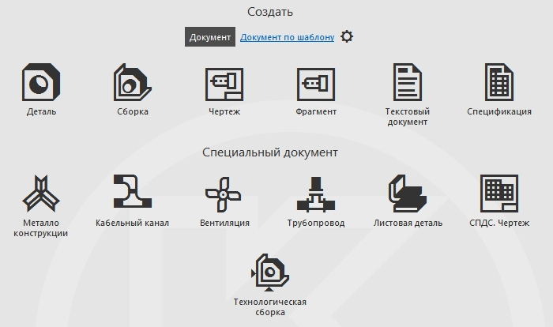
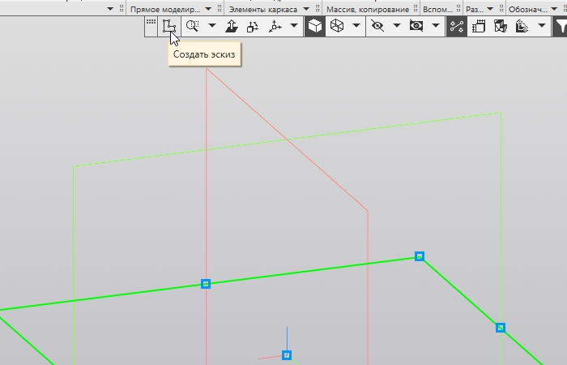
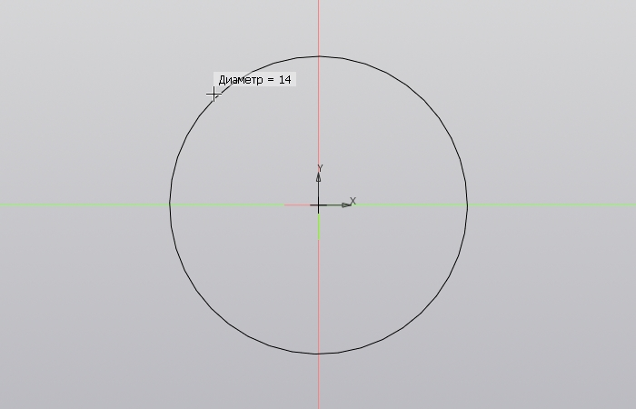
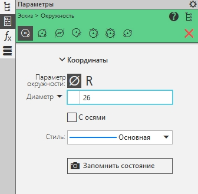
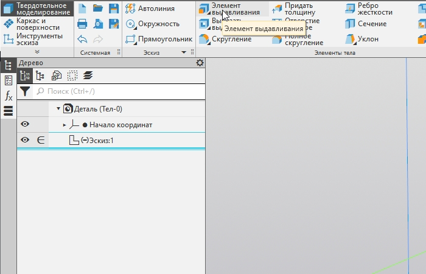
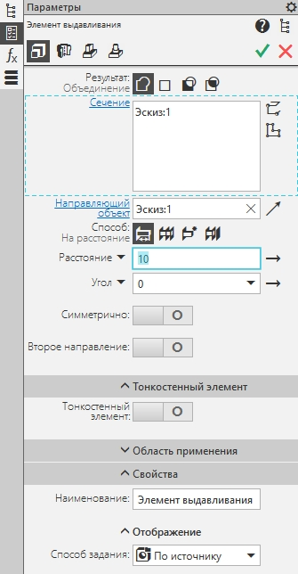
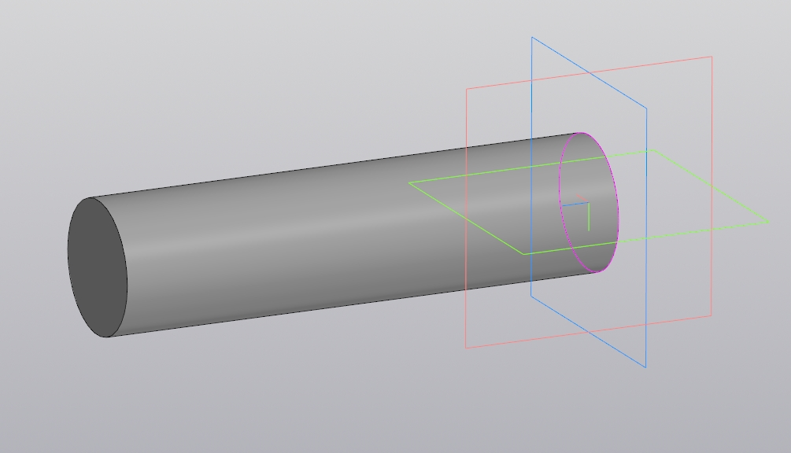

# Создание детали типа вал в Компас-3D
## Описание
В данной инструкции вы научитесь создовать простые детали типа вал в Компас-3D
## Требования
Наличие программы Компас-3D версии v.18 или старше
## Шаги
1. Откройте программу Компас-3D
1. На начальном экарне выберите опцию **"Деталь"**
   
   
1. Выберите любую плоскость
1. Нажмите на кнопку **"Создать эскиз"**
   
   
1. Во вкладке **"Геометрия"** выберите **"Окружность"**
1. Наведите курсор на центр осей и нажмите левую кнопку мыши

   
1. В панели **"Параметры"** в строке **"Диаметр"** выберите необходимый размер и нажмите *`Enter`*

   
1. Выйдите из режима эскиза и повторно нажмите на **"Создать эскиз"** (см. шаг 4)
2. Во кладке **"Элементы тела"** выберите **"Элемент выдавливания"**
   
   
4. В панели **"Параметры"** в строке **"Расстояние"** выберите необходимый размер и нажмите *`Enter`*

   
6. Нажмите *`Ctrl + Enter`*
## Возможные ошибки
Если после шага 11 операция не выполнена:  
1. Нажмите на феолетовое очертание эскиза  
1. Продолжите с шага 11
## Результат
После выполнения всех шагов будет создана деталь типа вал

